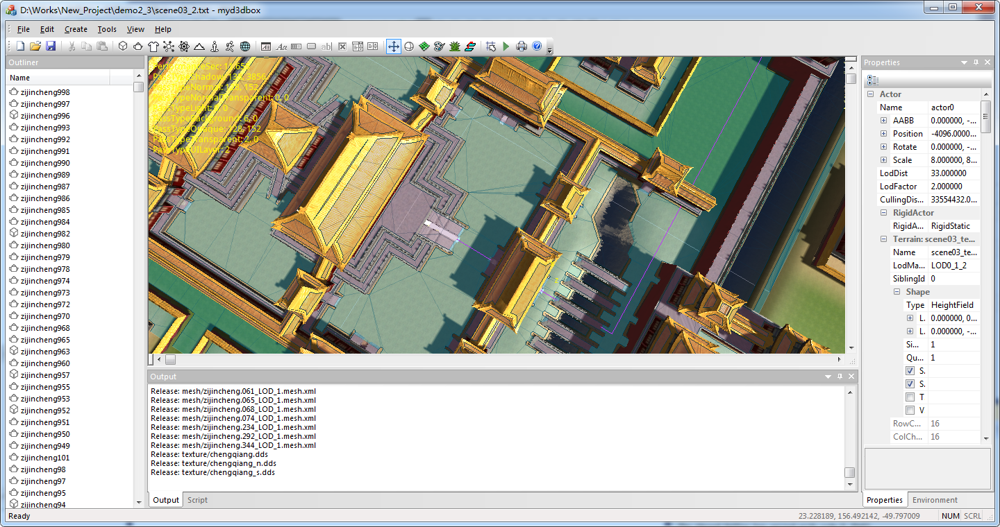

myd3dlib
====
A fast and lightweight Direct3D9 based game engine.

Features
----
Direct3D9 renderer 
Deferred lighting 
Asynchronous resource loading 
Octree scene management 
Terrain LOD 
Lua scripted UI and game logic 
MFC scene editor 

Dependencies
----
NVIDIA PhysX SDK 3.4.2 
boost 1.75.0 
rapidxml 1.13 
Recast Navigation 1.5.1 
FreeType 2.9.1 
zlib 1.2.11 
libzip 1.9.2 
Lua 5.1.5 
Luabind 0.9.1 
LuaJIT 2.1 
minimp3 
libogg 1.3.5 
libvorbis 1.3.7 
stb_image 2.27 
HdriToCubemap 

Screenshots
----

